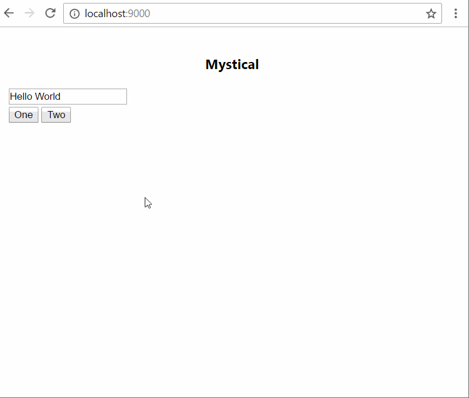
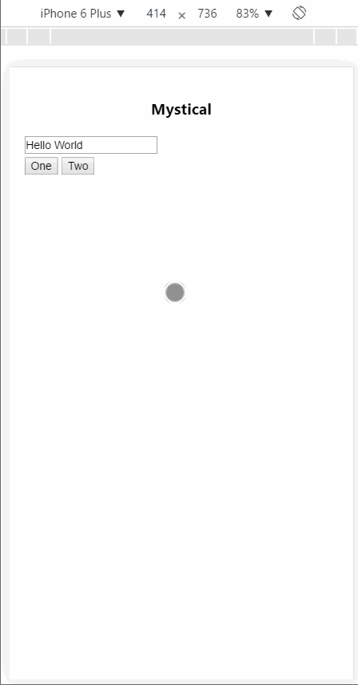

[](https://www.npmjs.com/package/mystical-notification)
[](https://www.npmjs.com/package/mystical-notification)
[](https://www.paypal.me/bradwayne88)


# Mystical-Notification

## Working Plunker
https://embed.plnkr.co/mp4hehLvOFLat3tLwN5j/

## What is it?
 Fully customizable alert notifications. Current types are *info*, *success*, *warning*, *alert* and *confirm*. Two positions for now are *top* and *bottom*.


| Sample Desktop        | Sample Mobile
| ------------- |:-------------:|
|      | 


### Installation
`npm install mystical-notification`

### Usage
If not using a module system you can get the dist file from unpkg CDN here: `https://unpkg.com/mystical-notification@01.0.0` and just add the script tag to your html page to have the `mystical` lib exposed. If you're using modules then it's best to use `npm install mystical-notification` and then import (see TS sample below).

### JS
```js
mystical.Mystical.alert({
    color: "#ff4081",
    backgroundColor: "#222",
    position: "bottom",
    template: `
      <div style="padding: 5px">
          <h3> Go Away </h3>
          <label> I don't care what you do man. </label>
      </div>
    `
  });
```

### TS
```ts
import { Mystical } from "mystical-notification"

public showInfoMsg() {
    Mystical.info(`<p>3 records updated. </p>`)
}

public showWarningMsg() {
    Mystical.warning(`<p>Oh no, you did something bad!</p>`)
}

public makeUserChoose() {
    Mystical.confirm({
        backgroundColor: "#fff000",
        color: "#333",
        position: "bottom",
        positiveText: "Do it!",
        negativeText: "Never!",
        template: `
            <p>Are you sure you want to delete these items? </p>
        `
    }).then((result: boolean) => {
        if (result === true) {
            /// user clicked positive(confirm) button
            console.log("Delete EVERYTHING")
        }
    })
}
```

### Public Methods
- `info(template: string)` - shows a blue colored info note. Will hide after 3 seconds and no backdrop shown.
- `success(template: string)` - shows a green colored success note. Will hide after 3 seconds and no backdrop shown.
- `warning(template: string)` - shows a red colored warning note. Has a backdrop and requires user action to dismiss.
- `alert(options: AlertOptions)` - shows simple alert notification
- `confirm(options: ConfirmOptions)` - shows a confirmation notification that requires user interaction to dismiss the note by clicking the backdrop or the positive/negative buttons. Only clicking the positive button returns `true`


### Options Interfaces 
```ts
interface AlertOptions {
    template: string;
    backgroundColor?: string;
    color?: string;
    position?: string; // top or bottom for now
    duration?: number // default is indefinite  so alert is show until user action
    backdrop?: boolean; // default = true
}

interface ConfirmOptions {
    template: string;
    backgroundColor?: string; // default #333
    color?: string; // default #fff
    position?: string; // top or bottom for now
    backdrop?: boolean; // default = true
    positiveText?: string; // default = "Yes"
    negativeText?: string; // default = "No"
}
```
### Contributing
- `git clone https://github.com/bradmartin/mystical-notification.git`
- `npm install` - install deps
- `npm run dev` - will transpile and kick off the webpack dev server
